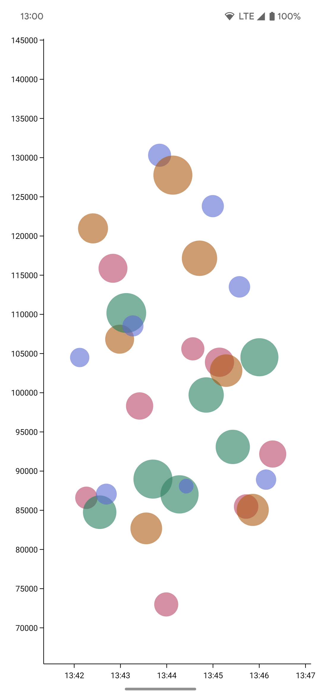
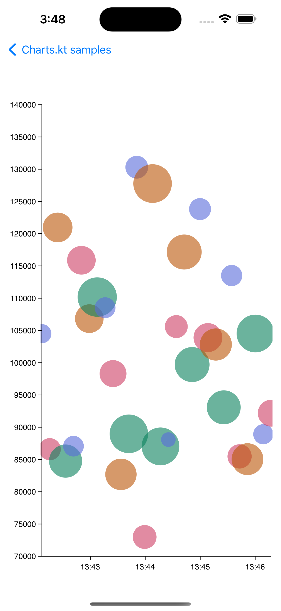
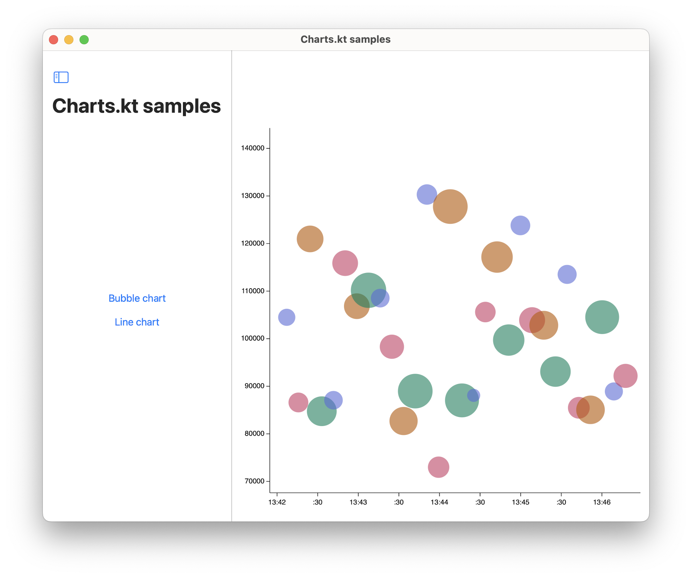

# Charts.kt samples

This is the official samples repository of Charts.kt,
a commercial Kotlin Multiplatform charting library that supports iOS, Android, the Web, and the JVM.

If you need a license to go beyond experimenting, click "Book a demo" on our website [charts-kt.io](https://charts-kt.io/).

   
   &nbsp;
   

## Important information

⚠️ We are still building this sample project.

Here's our short term plan:
- Add more sample charts to showcase all the important features of Charts.kt.
- Add Kotlin/JS and Kotlin/JVM in this project (currently, it's KMM only, i.e. iOS and Android).
- Add a nice icon for the sample app.

In the meantime, you can go on [our playground](https://play.data2viz.io/sketches?tag=charts.kt).

There, we have **40 examples in Kotlin/JS** that render live with code on the side.
You can edit and run them all online, they usually **compile and render within 1s**!

## How to use

1. Clone the project
2. Open the project in a recent Android Studio version
3. For Android, run the `androidApp` module on a physical or emulator device as usual
4. For iOS, open the Xcode project located within the `iosApp` directory
   a. Run on the iOS simulator
   b. Run as an iPad app on macOS (resizing the window is currently crashing, next version fixes it)
   c. Run on a physical iOS or iPadOS device as usual
5. Experiment with your charts, possibly taking inspiration from the ones found on [our playground](https://play.data2viz.io/sketches?tag=charts.kt)

